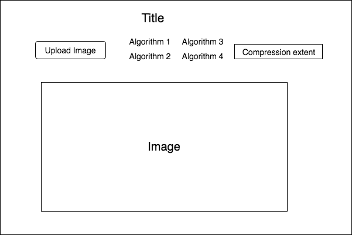

# Image Sampling Visualization

## Background

Images play a huge part in every website and application. The continuous nature of colors and the discrete nature of computers, however, make for an interesting conflict. The RGB color scheme, with 256 variations for each of the three colors, was designed to merge these two conflicts together. Still, images can take up a lot of space when the pixel count gets large. As such, lossless compression and lossy compression methods alike are used to keep image loading times at a manageable level. This application will look into a couple of the lossy compression methods.
- random pixel sampling
- Mitchell's best-candidate algorithm
- stratified color sampling
- chroma subsampling

## Functionality & MVP

Using the image sampling simulator, users will be able to:

- [ ] Witness effects of sampling methods on images
- [ ] Select amount of compression for each sampling method
- [ ] Upload images from local to test out the effects
- [ ] Use existing test images to test out the effects

## Wireframes

This app will have a single screen with an input box for users to upload images. There will be a list of selections for users to choose the image compression algorithm to be used, and scroll knob that can be used to select the extent of compression to be done. There will also be links to the github repository and my linkedin profile.

## Architecture and Technologies

This project will be implemented with the following technologies:

- Vanilla `javascript` for overall structure and image compression logic
- `HTML5 Canvas` for DOM manipulation and rendering
- `Webpack` to bundle the scripts

## Implementation Timeline

### Day 1:

Functional
- [ ] Get file structure out, including webpack, node modules and entry file

Visual
- [ ] Display test image

### Day 2:

Functional
- [ ] Get different image compression algorithms out, use hard coded image compression amount

Visual
- [ ] Seeing changes in image through implementation of different compression algorithms

### Day 3:

Functional
- [ ] Get knob for controlling image compression amount

Visual
- [ ] See live changes upon moving the knob

### Day 4:

Visual
- [ ] Work on styling of image to make operations intuitive

## Bonus features

- [ ] Add lossless compression methods
- [ ] Allow users to download and safe compressed image
- [ ] Allow users to upload custom images
