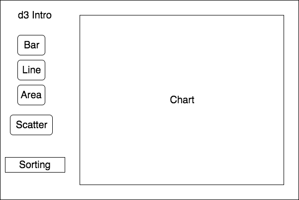

# D3 Introduction

## Background

d3 is a well-known data visualization library that builds on svg and other html tags, providing a simpler way to plot out different charts. Many other charting libraries, such as Recharts.js and Victory.js are also built on top of the d3 foundation. Having used Recharts for my [full stack project](https://github.com/travelingpiano/Chartalize), I will be using d3 to reproduce similar chart effects as Recharts.

## Functionality & MVP

Using the chart simulator, users will be able to:

- [ ] Plot different types of graphs
- [ ] See value by hovering over the data point
- [ ] Sort by x and y axes
- [ ] Test out effects using existing data sets

## Wireframe

This application will have a simple interface. There will be some buttons on the left representing the different chart types available. There will also be two dropdown menu, one that allows the user to select the type of sorting method to use and another that allows the user to select the data set to use.

## Architecture and Technologies

This project will be implemented with the following technologies:
- Vanilla `javascript` for overall structure
- `d3 4.0` for charting and HTML DOM manipulation
- `CSS3` for styling of chart

## Implementation Timeline

### Days 1 and 2:

Functional
- [ ] complete d3 tutorial, have general understanding of d3 procedure

### Day 3:

Functional
- [ ] Be able to generate >= 2 types of charts (order: bar -> scatter -> line -> area)

### Day 4:

Visual
- [ ] Be able to display value in box on hover

## Bonus features

- [ ] Add pie chart
- [ ] Allow for plotting of multiple y axes
- [ ] Allow user to upload and visualize custom data set
