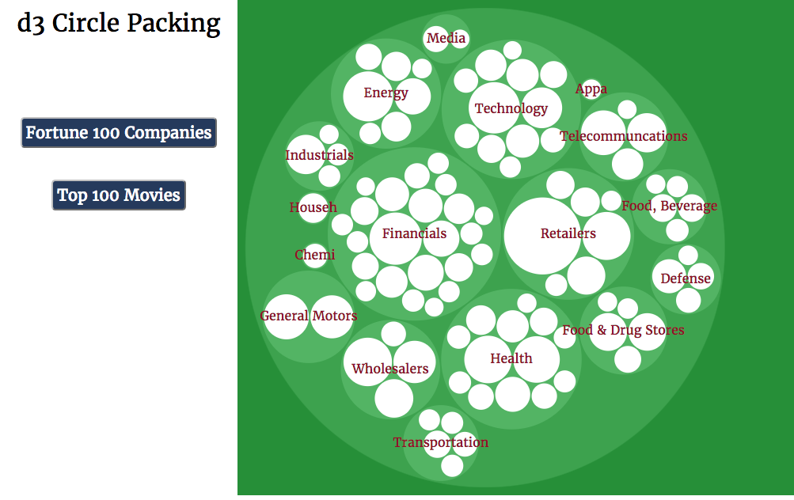
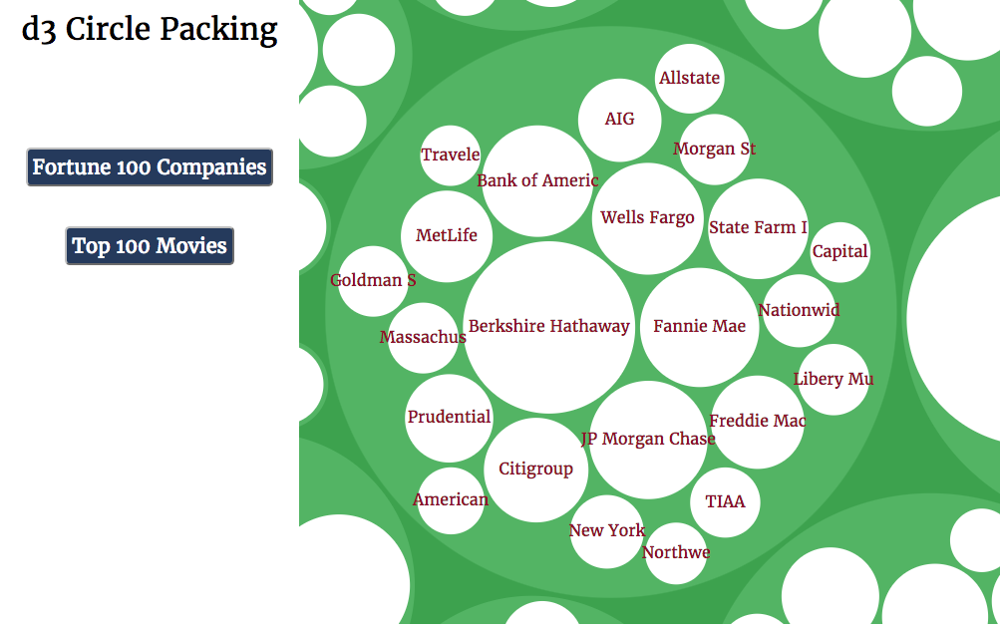

# d3 Intro

d3 Intro is a Javascript/d3 project that aims to allow users to experience the circle pack feature of the d3 library using vanilla Javascript, d3 presented with CSS3 and HTML 5.

## Features

- [x] Circle pack generation
- [x] Zooming feature for nested circle packs
- [x] Responsive circle pack
- [x] Multiple data sets for greater experience
- [x] Hovering tooltip for innermost circles of the packs

## Design

This project uses the d3 pack and interpolateZoom modules to visualize the circle packing and zooming features respectively. On page load, the root circle pack for the first data set, revenues for the Fortune 100 companies, is shown.

On clicking a smaller circle, the page is zoomed in to that pack of circles, and the abbreviated contents of the new nested circles are displayed.

On hovering the nested circles, details about the circle is presented.

## Future

Here are some features that I would like to implement in the future:
- [ ] Sort circle packs
- [ ] Have animation for circle packs
- [ ] Allow user to upload custom data to view circle pack
- [ ] Learn other chart plotting tools using d3
