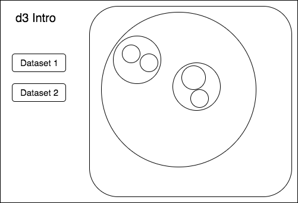

# D3 Introduction

## Background

d3 is a well-known data visualization library that builds on svg and other html tags, providing a simpler way to plot out different charts. Many other charting libraries, such as Recharts.js and Victory.js are also built on top of the d3 foundation. Having used Recharts for my [full stack project](https://github.com/travelingpiano/Chartalize), I will be looking at d3 to go one level deeper in the chart creation process.

## Functionality & MVP

Using the circle pack simulator, users will be able to:

- [ ] View circle packing in action
- [ ] Zoom over clustered groups of circles to see details
- [ ] View circle pack regardless of browser window size
- [ ] Test out effects using existing data sets

## Wireframe

This application will have a simple interface. There will be some buttons on the left representing the different datasets available. The circle pack will be shown on the right.

## Architecture and Technologies

This project will be implemented with the following technologies:
- Vanilla `javascript` for overall structure
- `d3 4.0` for charting and HTML DOM manipulation
- `CSS3` for styling of chart

## Implementation Timeline

### Days 1 and 2:

Functional
- [ ] complete d3 tutorial, have general understanding of d3 procedure

### Day 3:

Functional
- [ ] Be able to generate circle pack

Visual
- [ ] Be able to view entire circle pack regardless of browser size

### Day 4:

Visual
- [ ] Able to select more than one dataset

## Bonus features

- [ ] Allow for sorting of circle pack
- [ ] Have hover effects to see more details on circle in circle pack
- [ ] Allow user to upload and visualize custom data set
